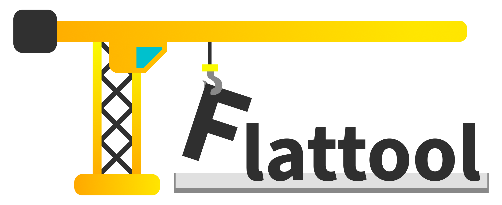

# flattool

Flattool is a command line script that should make dealing with flatpaks through the command line better.

## Flattool has 3 main uses.
1. Flattool can handle multiple installs in a loop instead of all at once, meaning that if a match is not found, your entire queue is not lost.
2. Flattool makes running apps from the command line easier. Instead of needing to use the app's full Application ID, you need only to type in a query for flattool to match.
3. Flattool can help clean up orphaned user files. Flattool will find any user data files that do not have an associated flatpak installed, and either trash the folder or attempt to install the flatpak, based on your choice.

## Important things to note:
- This is my first big project, there's a reason the version number doesn't start with a 1, haha. All this to say that I foresee that there could be issues.
- Flattool assumes that flatpak user data is stored within ~/.var/app (the default location for these folders).
- Flattool is not a replacement for flatpak, it merely sends the appropriate flatpak commands for the action.
- Flattool uses `gio trash` to remove folders, not rm, so if you want to clear your diskspace you'll still need to empty your trash. This is to avoid any perminant deletion of files.

## How to install:
1. Download the `flattool` file from this repo.  
2. Run `printf $PATH` in your terminal.  
3. Place this newly downloaded flattool script within any directory mentioned in the output of that command.
4. Navigate to where you have moved flattool and run `chmod +x flattool`. This will allow flattool to be executed.  

All set! Now all you need to do is run flattool with `flattool --help`.
